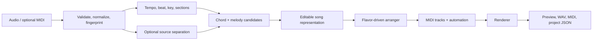

# Product and technical design

## The sound: a controllable family, not a single preset

The target is a set of musical behaviors. A good arrangement generally combines these levers:

| Lever | Typical behavior | Parameterization |
| --- | --- | --- |
| Timbre | bright, small-scale, slightly percussive melodic voices; warm simple bass | palette, attack, brightness, register |
| Melody | clear, singable lead with short ornamental answers | quantization, grace-note rate, call-and-response |
| Harmony | diatonic, friendly extensions, compact voice-leading | chord color, inversion policy, density |
| Rhythm | light syncopation, crisp shakers/hand percussion, relaxed swing when appropriate | swing, humanize amount, drum pattern, density |
| Form | small loops and short transitions that preserve the source hook | loop length, fill frequency, section contrast |
| Mix | intimate and clean, modest room space, not huge cinematic processing | reverb, stereo width, dynamic range |

Flavor presets set sensible defaults; each lever stays independently editable. Presets should be *inspired by* moods/eras and use original names and licensed/original sounds.

## Inputs and confidence

Audio analysis is probabilistic. Every generated element therefore carries a confidence score and source reference (automatic, user MIDI, user edit). The UI surfaces uncertain notes/chords first.

| Input | Best use | Limitation |
| --- | --- | --- |
| Full mix | tempo, form, rough harmony and lead candidate | vocals and dense mixes confuse pitch/stem extraction |
| Instrumental/stems | much better harmony and melody extraction | rarely available |
| MIDI | near-perfect timing and notes | may be an arrangement rather than the recording |
| Lyrics + timestamps | phrase boundaries and syllable rhythm | text has no pitch; timestamps still need melody extraction |
| User edits | authoritatively correct musical content | needs a friendly editor |

## Processing pipeline



Source separation is optional and should be a background job: it is costly, adds artifacts, and is not required for MIDI input or simple recordings.

## Core representation

Keep musical facts separate from their rendering. That lets a user switch flavor without re-running analysis.

```text
Project
  SourceAsset (temporary upload reference, rights acknowledgement)
  Analysis (tempo map, key candidates, segments, confidence)
  SongChart (beats, chords, melody notes, user overrides)
  Arrangement (flavor parameters, tracks, patterns, automation)
  Render (engine/version, output locations, status)
```

Tracks for the first arranger: lead, countermelody, chord comp, bass, hand percussion, and optional texture. Each track uses a role rather than a fixed sample name.

## Components

| Component | Responsibility |
| --- | --- |
| Web editor | upload, flavor selection, waveform, chord/MIDI corrections, preview/export |
| API | projects, signed upload/download URLs, job status, preset catalog |
| Analysis worker | beat/key/section/chord/melody candidates and confidence |
| Arrangement engine | deterministic role assignment, voicing, patterns, humanization, transitions |
| Render worker | turn MIDI + licensed/original sound palette into preview audio |
| Storage/queue | isolate long-running jobs, expire raw inputs, retain user project metadata |

## Milestones

1. **Playable vertical slice:** import MIDI, choose a preset, arrange, export MIDI. No ML ambiguity.
2. **Editable audio path:** audio upload, beat/key/form detection, user enters/corrects chords and melody.
3. **Assisted transcription:** chord/melody candidates with confidence and review workflow.
4. **Polish:** source separation option, preview streaming, shares/private projects, more palettes.

## Deliberate non-goals for v1

- Perfect transcription from arbitrary commercial mixes.
- Exact replication of any game's proprietary sample library or a named game's soundtrack.
- Public sharing of source uploads by default.

## Key design decision

Start MIDI-first. It proves the fun part—the arranger and flavor system—before investing in the least reliable portion, full-mix transcription. Audio import can initially produce a tempo-grid and guided editor, then become more automated as analysis improves.
